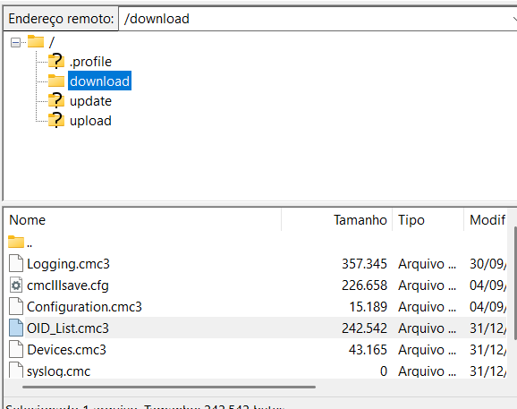
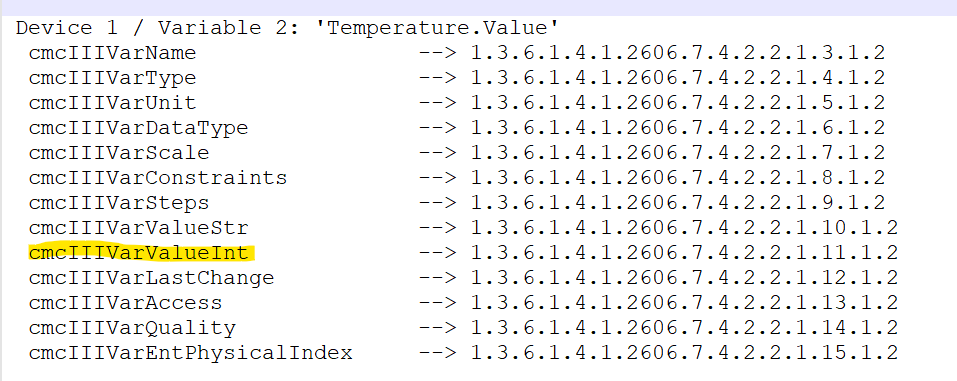

# Zabbix Template - Rittal CMC III PU

Este repositório contém um template para monitoramento de dispositivos Rittal CMC III PU no Zabbix. O template foi desenvolvido para facilitar a integração e o monitoramento de sensores e alarmes fornecidos pelos appliances da Rittal.

---

### Itens Monitorados

O template inclui os seguintes itens:

- **Alarme Climas**  
- **Alarme Líquido**  
- **Alarme Stratos**  
- **Falha FM200**  
- **Falha Gerador**  
- **Falha GMG**  
- **Falha UPS X**  
- **Falha UPS Y**  
- **Umidade**  
- **Porta Aberta**  
- **Temperatura**  
- **Temperatura Appliance**  

### Triggers

- **17 Triggers Padronizadas**: Configurações de alerta baseadas nos itens monitorados.

### Dashboards

- **Umidade**: Visualização em tempo real dos níveis de umidade.  
- **Temperatura**: Gráficos de monitoramento de temperatura.

## Configuração

Os appliances da Rittal possuem sensores em portas diferentes. Siga os passos abaixo para configurar o template:

1. **Acesse o Appliance via FTP**  
   Utilize um cliente FTP como FileZilla para acessar o IP do dispositivo.

   

2. **Baixe a Lista de OIDs**  
   Navegue até a pasta `download` e baixe o arquivo `OID_List.cmc3`.  

3. **Depure e Altere os OIDs no Template**  
   Edite o template para ajustar os OIDs dos dispositivos, utilizando o identificador `cmcIIIVarValueInt`.  

   

4. **Valide os Valores com SNMPWalk**  
   Utilize o comando `snmpwalk` para verificar os valores retornados pelos sensores e garantir que os OIDs estão configurados corretamente.  

## Pré-requisitos

- **Zabbix Server**: Versão 6.0 ou superior.  
- **Cliente FTP**: FileZilla ou similar.  
- **SNMP Tools**: Para validação dos OIDs.  

## Observações

- Certifique-se de que o SNMP está habilitado no appliance.  
- Caso encontre problemas, consulte a documentação oficial da Rittal ou entre em contato com o suporte técnico.  

## Documentação Adicional

Para mais informações sobre browser e sftp e uso do Rittal CMC III, consulte o seguinte documento oficial que encontrei em alemão :( 

[Guia de Configuração: CMC III MIB und ServersCheck MIB-Browser (PDF)](https://www.rittal.de/downloads/rimatrix5/security/CMCIII/Howto_CMCIII_MIB_und_ServersCheck_MIB-Browser_de.pdf)

## Licença

Este template é distribuído sob a licença MIT. Consulte o arquivo `LICENSE` para mais detalhes.

